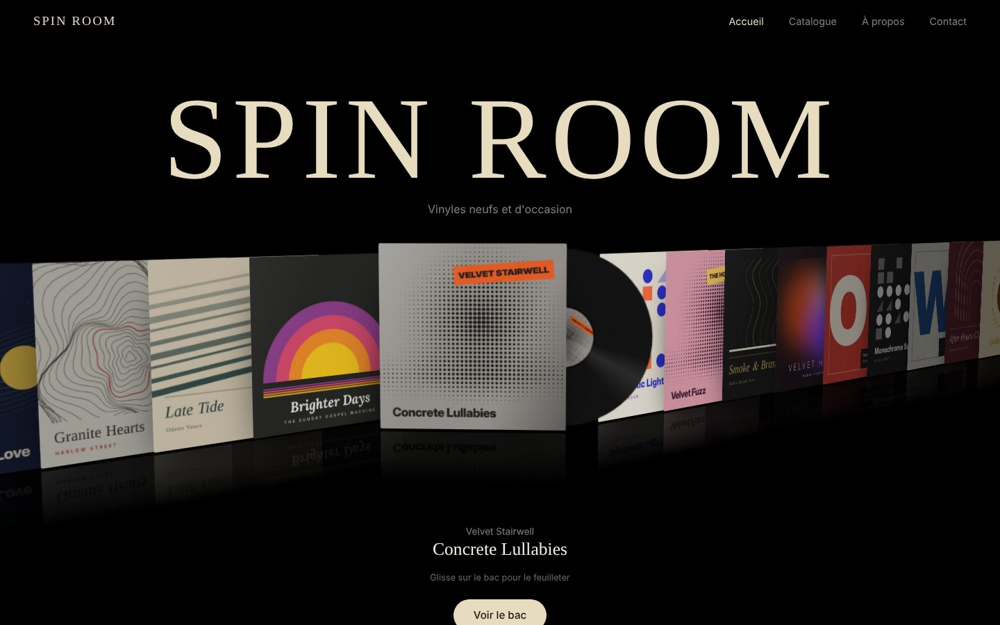

# SPIN ROOM

Site d'un disquaire en ligne imaginaire, vinyles neufs et d'occasion, construit en HTML, CSS et JavaScript, sans librairie.

**[Voir la démo en ligne](https://charlesdev-web.github.io/spin-room/)** · **[Lancer la visite guidée](https://charlesdev-web.github.io/spin-room/?tour)**

https://github.com/user-attachments/assets/17960adf-956e-4308-b41b-01c2b479d3ab

> Projet de démonstration pour mon portfolio. Les artistes, les albums, les prix et les pochettes sont fictifs ; les pochettes ont été générées en code pour le projet.

## Ce que fait le site

- **Un bac à vinyles en 3D** : les pochettes forment une rangée en perspective qu'on feuillette au glisser (souris, trackpad ou doigt), au clic ou avec les flèches du clavier.
- **Le disque mis en avant** se redresse, avance, et son vinyle sort de la pochette en tournant. L'étiquette du disque reprend la pochette ; quelques albums ont un vinyle coloré.
- **La scène réagit** à la position de la souris et défile toute seule à l'arrivée, jusqu'à la première interaction.
- **Une sélection du moment** avec étiquettes Neuf / Occasion, note d'état et prix.
- **Un menu plein écran** sur téléphone.
- **Un catalogue** des 30 disques, avec recherche, filtres par genre et par état, et tri (prix, artiste, année, nouveautés). Les filtres restent dans l'adresse, pour partager un lien.
- **Une fiche par disque**, générée à partir des données : pochette, vinyle qui sort et tourne, état, prix, description et disques du même genre.
- **Un panier** en panneau latéral, partagé par toutes les pages et gardé dans le navigateur : un exemplaire par disque, sous-total, livraison offerte dès 60 €, commande de démonstration (aucun paiement).
- **Un mode visite guidée** (`?tour` à la fin de l'adresse) qui parcourt l'accueil tout seul, pratique pour enregistrer une vidéo de présentation.

## Technique

- HTML, CSS et JavaScript « vanilla », sans framework ni dépendance.
- Les données des disques sont dans un seul fichier, `disques.js`, partagé par les trois pages (accueil, catalogue, fiche). Le panier est un module à part, `panier.js`, qui s'ajoute tout seul au menu de chaque page.
- 3D réalisée en **CSS** (`perspective`, `transform-style: preserve-3d`, `translate3d`), animée en JavaScript avec `requestAnimationFrame` et un lissage des mouvements.
- Polices **Fraunces** (titres) et **Inter** (textes) hébergées dans le projet, sans appel à un service externe.
- Responsive (ordinateur et téléphone), navigation au clavier, respect du réglage « réduire les animations ».
- Publication avec **GitHub Pages**.

## Lancer le projet

Aucune installation : télécharger le dépôt et ouvrir `index.html` dans un navigateur.

Pour ajouter un disque : déposer une image carrée JPG dans `pochettes/`, puis ajouter une ligne dans `disques.js`. Le disque apparaît alors dans le bac, le catalogue et sa propre fiche.

## Prochaines étapes

- Animation du bac qui se vide en passant de l'accueil au catalogue
- Pages « À propos » et « Contact »

---

Réalisé par [charlesdev-web](https://github.com/charlesdev-web), en reconversion vers l’informatique.
